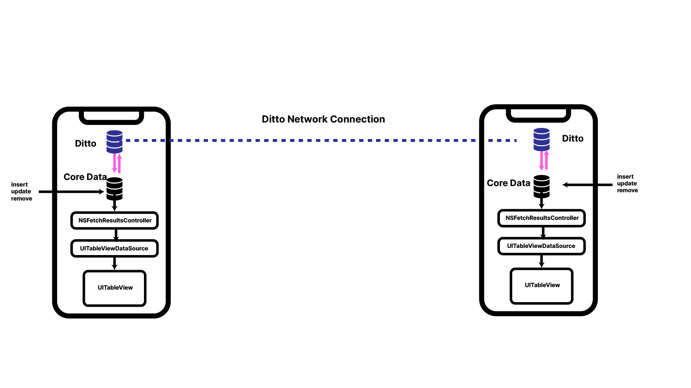

# Ditto Core Data Bidrectional Sync

1. First run `pod install --repo-update`
2. Open `DittoCoreData.xcworkspace`
3. Create the missing file `license_token.txt` and paste in your license token
3. Run the app on either a simulator or your actual device.

## Architecture 

### Unidirectional Update

1. Ensure that your app only edits Ditto for insertions, updates, and deletes
2. Hook up a Ditto `LiveQuery` to diff and update CoreData
3. Let `NSFetchResultsControllerDelegate` implementation update the `UITableView`

### Bidirectional Update

1. Edit core data objects.
2. Let `NSFetchResultsControllerDelegate` implementation update the `UITableView` _and_ Ditto collection Documents.
3. Hook up a Ditto `LiveQuery` to diff and update CoreData

## Commentary

* This sample app uses the pod `Fakery` to generate some random data.
* Attempting to keep Core Data and Swift requires a surpring amount of manual coding, you may find it far easier to refactor to Ditto outright
* Ideally, syncing between Core Data and Ditto is _not something you should do_. Syncing very different databases is a very difficult especially since Core Data was never designed as a syncing database.
 
