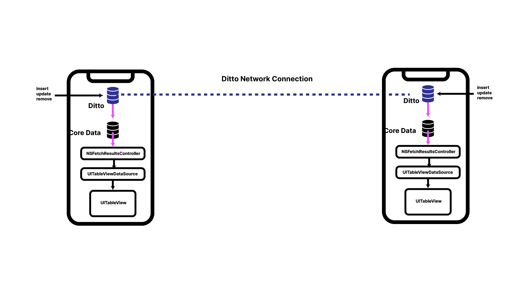

# Ditto Core Data Bidrectional Sync

1. First run `pod install --repo-update`
2. Open `DittoCoreData.xcworkspace`
3. Create the missing file `license_token.txt` and paste in your license token
3. Run the app on either a simulator or your actual device.

## Architecture

## Commentary

This sample app uses the pod `Fakery` to generate some random data.

Ideally, syncing between Core Data and Ditto is _not something you should do_. Syncing very different databases is a very difficult 